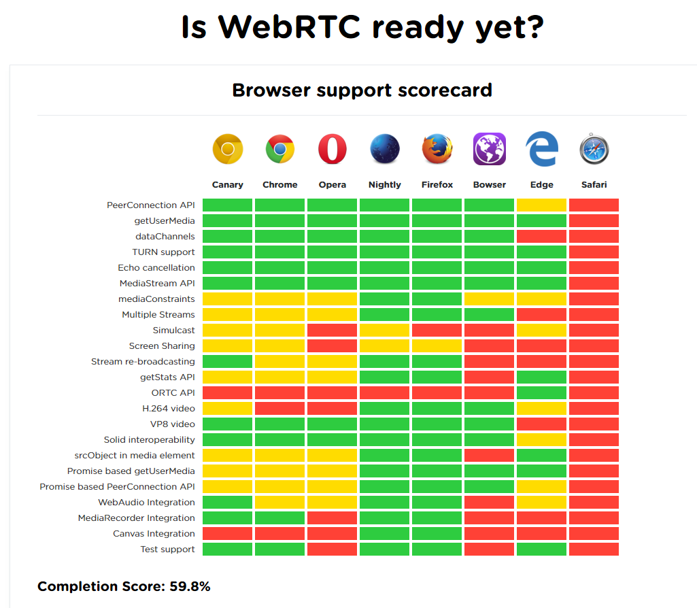

# Eindopdracht

http://onwezen.github.io/browsertecheindopdracht/public_html/

(WebRTC old project)
https://github.com/onwezen/Project-Digital-Learning/blob/master/PDL/src/main/webapp/virtualclassroom.jsp

##Bevindingen

Aan het begin van de week ben ik begonnen met WebRTC uitzoeken, echter duurde het te lang om de hele node server en fallback voor de messages
te gaan bouwen, ik heb dit deels echter is dit niet functioneel.

##Feature

Halverwege de week ben ik overgestapt naar het onderzoeken van Drag & Drop. Drag & Drop is het verplaatsen van een element naar een ander target element normaal gesproken d.m.v. de muis, echter moet dit ook met het keyboard toegankelijk zijn.

##Support

Voor drag & drop is een makkelijke HTML5 optie voor maar deze is helaas
niet beschikbaar in elke browser natuurlijk. Zo is hij niet beschikbaar in iOS safari, op opera mini, android browsers en chrome voor android.
http://caniuse.com/#feat=dragndrop

Een oplossing die ik hier zelf voor heb bedacht is het clicken van een element en deze vervolgens verplaatsen naar de juiste andere plek.
Wanneer juist uitgevoerd kan dit dynamisch geïmplementeerd worden op dezelfde manier als het drag & droppen. Het enige wat hier wel vereist
voor is is JavaScript.

##Accessibility 

Verder heb ik de accessibility onderzocht van drag and drop. Eerst heb ik gekeken hoe ik de events kon starten, wat best te doen is met wat javascript echter is het selecteren van een drop target en het dan daadwerkelijk droppen wel vrij tricky. Hier is echter al iets op bedacht en dat is het "copy pasten" van de elementen zoals je gewend bent met bijvoorbeeld files, echter is dit nog niet gesupport in alle browsers. 

http://html5doctor.com/accessibility-native-drag-and-drop/

De roles ARIA-Grabbed en ARIA-Dropeffect zijn er voor screenreader gebruikers, deze moeten echter wel gebruikt worden wanneer het echt van toepassing is aangezien drag & drop voor heel veel doeleinden gebruikt kan worden en andere ARIA roles misschien duidelijker kunnen zijn.

http://www.ssbbartgroup.com/blog/accessible-drag-and-drop-why-foolproof-scripting-is-critical-when-using-aria/

