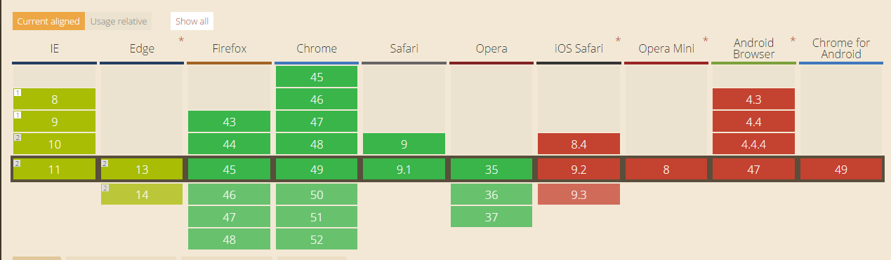

# Eindopdracht

##Bevindingen

Aan het begin van de week ben ik begonnen met WebRTC uitzoeken, echter duurde het te lang om de hele node server en fallback voor de messages
te gaan bouwen, ik heb dit deels echter is dit niet functioneel.

Halverwege de week ben ik overgestapt naar het onderzoeken van Drag & Drop. Hier is een makkelijke HTML5 optie voor maar deze is helaas
niet beschikbaar in elke browser natuurlijk. Zo is hij niet beschikbaar in iOS safari, op opera mini, android browsers en chrome voor android.

http://caniuse.com/#feat=dragndrop

Een oplossing die ik hier zelf voor heb bedacht is het clicken van een element en deze vervolgens verplaatsen naar de juiste andere plek.
Wanneer juist uitgevoerd kan dit dynamisch geïmplementeerd worden op dezelfde manier als het drag & droppen. Het enige wat hier wel vereist
voor is is JavaScript.

